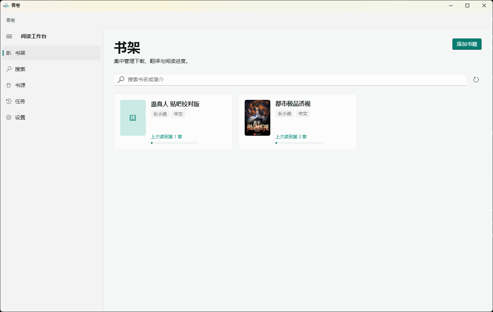

<!-- markdownlint-disable MD033 MD041 -->
<p align="center">
  
</p>

<h1 align="center">青卷 QingJuan</h1>

<p align="center">
  Windows 小说与漫画下载、翻译和阅读工具
</p>

青卷支持 Windows 本机使用，也支持把后端部署到 Linux 服务器，再由 Windows 客户端远程连接。



> 项目仍在持续开发。网站规则变化时，部分下载功能可能暂时失效。请只保存你有权访问的内容。

## 功能

- 从常见小说、漫画网站导入作品
- 导入本地 `TXT`、`DOCX`、`EPUB` 和 `PDF`
- 下载章节并查看任务进度
- 使用 OpenAI 兼容接口翻译小说和漫画
- 导出 `TXT`、`DOCX`、`EPUB`、`PDF` 或图片压缩包
- 阅读原文和译文，保存阅读进度
- 使用 Windows TTS 听书
- 支持亮色、深色和跟随系统主题

目前支持番茄小说、哔哩轻小说、Kakuyomu、Syosetu、Novel18、Pixiv、Webtoon、拷贝漫画、动漫之家、
18Comic、Bika 等站点，也支持导入 Legado / 阅读 App JSON 书源。

## 使用方法

### 便捷版

适合直接在一台 Windows 电脑上使用：

1. 前往 [Releases](https://github.com/Tavre/QingJuan/releases/latest) 下载 Windows ZIP。
2. 完整解压 ZIP，不要单独移动或删除其中的文件。
3. 双击 `qingjuan.exe`。

应用默认使用“本机后端”，不需要另外安装 Python。

### Linux 后端 + Windows 客户端

先在 Linux 服务器执行：

```bash
sudo mkdir -p /opt/qingjuan
sudo git clone https://github.com/Tavre/QingJuan.git /opt/qingjuan/app
cd /opt/qingjuan/app
sudo bash deploy/linux/install.sh --url http://10.0.0.20:19453 --bind 0.0.0.0
sudo qingjuan-info
```

将示例中的 `10.0.0.20` 改成 Windows 电脑能够访问的服务器私有 IP。安装完成后，
`sudo qingjuan-info` 会显示 FastAPI 地址和连接 Token。

然后在 Windows 应用中：

1. 打开 **设置 → 后端连接**。
2. 将“连接模式”改为 **Linux 远程后端**。
3. 填写服务器显示的“FastAPI 地址”和“连接 Token”。
4. 点击 **保存设置**。

FastAPI 地址不要添加 `/api/v1`。公网访问必须使用 HTTPS，不要直接暴露公网 HTTP 端口。

常用服务器命令：

```bash
# 查看状态
sudo systemctl status qingjuan-backend --no-pager

# 查看日志
sudo journalctl -u qingjuan-backend -f

# 更新后端
sudo bash /opt/qingjuan/app/deploy/linux/update.sh
```

## 数据与安全

- Windows 数据保存在应用目录的 `backend/data/`
- Linux 数据保存在 `/var/lib/qingjuan`
- 更新或迁移前请先备份数据目录
- 不要公开连接 Token、翻译 API 密钥、Cookie、数据库和下载内容
- 远程连接建议使用局域网、Tailscale / WireGuard 或 HTTPS

## 开发与贡献

开发环境、项目结构、测试和发布说明见[开发文档](./docs/development/README.md)。

欢迎提交 [Issue](https://github.com/Tavre/QingJuan/issues) 或 Pull Request。提交代码前请移除密钥、账号和个人数据。

## 交流

- GitHub：[Tavre/QingJuan](https://github.com/Tavre/QingJuan)
- QQ 群：`1074882763`
- 安全问题请使用 GitHub 的 **Security → Report a vulnerability** 私密报告

## 许可与致谢

本项目使用 [GNU GPL v3](./LICENSE) 许可证。

感谢[所有贡献者](https://github.com/Tavre/QingJuan/graphs/contributors)，以及 Flutter、FastAPI、RapidOCR、
`fluent_ui`、[fanqie-assistant](https://github.com/naiyQAQ/fanqie-assistant) 等开源项目。
